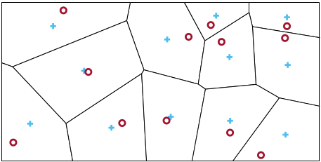
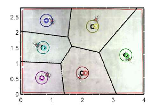
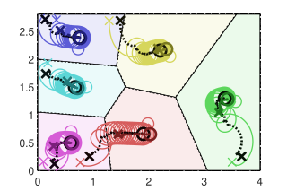

# Optimal Coverage Control of Multiple Constant-Speed Unicycle Robots (CSUR)

**Author:** ***Nhan Khanh Le*** (nhankhanh.le@tum.de) and ***Zengjie Zhang*** (z.zhang3@tue.nl).

The experimental studies of a decentralized optimal coverage controller for multi-agent systems with multiple constant-speed unicycle robots (CSURs).

Refer to our [GitHub repository](https://github.com/zhang-zengjie/csur-converage-control) for the up-to-date programs.

## Introduction

Cooperative coverage control of multi-agent systems is an important problem for various practical applications such as event monitoring, production measuring, and resource
allocation. The objective of coverage is to effectively allocate multiple agents in the region with a certain criterion optimized. For a specific type of coverage problem with Euclidean distance metrics and uniform distribution, the optimal coverage is dominated by a Voronoi tessellation, as shown in **Fig. 1**. A stable optimal coverage controller is expected to drive the agents to eventually reach the centroids of the corresponding Voronoi partitions.



**Figure 1. An example of coverage control. Red ‘o’ are agent positions and blue ‘+’ are the Voronoi centroids. The optimal coverage is achieved when all agents reach their corresponding Voronoi centroids.**

### Optimal coverage control of Constant-Speed Unicycle Robots (CSURs)

Most of the conventional work on coverage control has focuses on quadcopters which have trivial single-integrator models. Constant-Speed Unicycle Robots (CSURs) refer to a type of robots with unicycle dynamic models, moving at constant speeds. A fixed-wing drone is a typical CSUR, which has many advantages over a quadcopter, such as heavier loads and longer cruising time. A CSUR cruises in a 2-D plane but is steered by a 1-D control command, leading to an under-actuated control structure. This makes the coverage control of CSURs more difficult than single-integrator agents like quadcopters.

### Approach

In this project, we have developed a novel optimal coverage controller for multiple CSURs. The design of the controller is based on a novel Barrier Lyapunov function that measures how far the agents are from the optimal reaching points (referred to as Local optimal configuration (LOC)). The controller is designed as a searching law towards the direction of the negative gradient of the Barrier Lyapunov function, ensuring that all agents eventually reach a LOC and never move out of the coverage region. This approach is promising to be used for coverage control with fixed wing drones.

This project contains the simulation and experimental studies of this approach to validate its efficacy. An example of optimal coverage control of CSURs using this approach is illustrated in **Fig. 2**. The theoretical details of this work can be referred to in our associated publication:

- Liu, Qingchen, Zengjie Zhang, Nhan Khanh Le, Jiahu Qin, Fangzhou Liu, and Sandra Hirche. "Distributed Coverage Control of Constrained Constant-Speed Unicycle Multi-Agent Systems." *IEEE Transactions on Automation Science and Engineering* (2024).

Also see a Youtube [video](https://www.youtube.com/watch?v=XUEx6HEZPAM) how this project performs.




**Figure 2. The ultimate optimal coverage configuration of 6 CSURs (left) and the reaching process (right).**


## File Structure:

- `README.md`: this read me file.
- `LICENSE`: the license file.
- `sim_main.m`: the main script to generate simulation results.
- `exp_main.m`: the main script to generate experimental results.
- `/src`: the source files.
- `/param`: the parameter setting files.
- `/lib`: the library files. 
- `/data`: the files containing hardware experiments.
- `/figs`: the figure files.

## Requirements:

- Operating system: no specific requirements
- MATLAB: no specific requirements on versions
    - [Mapping toolbox](https://nl.mathworks.com/products/mapping.html)

## Quick Start

### Generate figures of the simulation study

1. Open the `sim_main.m` script, select the parameter setting command for the desired simulation study:
    | command name | case number | case name | configuration |
    | ---- | ---- | ---- | -----|
    | `set_sim_case_1_param` | #1 | different initial conditions | #1 |
    | `set_sim_case_2_param` | #1 | different initial conditions | #2 |
    | `set_sim_case_3_param` | #1 | different initial conditions | #3 |
    | `set_sim_eps_10_param` | #2 | different parameters | $\varepsilon$ |
    | `set_sim_gamma_10_param` | #2 | different parameters | $\gamma$ |
    | `set_sim_Q_10_param` | #2 | different parameters | $Q$ |
    | `set_sim_large_param` | #3 | large number of robots | $100$ agents |
    | `set_sim_compare_proposed_param` | #4 | comparison study | proposed |
    | `set_sim_compare_conv_param` | #4 | comparison study | conventional |


2. Run the `sim_main.m` script to generate figures for simulation study.
```
sim_main
```


### Generate figures of the hardware experiment

1. Go to `exp_main.m`, change the case number to `'1'`, `'2'`, or`'3'`, for case 1, 2, or 3, respectively.

2. Run the `exp_main.m` script to generate figures for the hardware experiment.
```
exp_main
```


 

